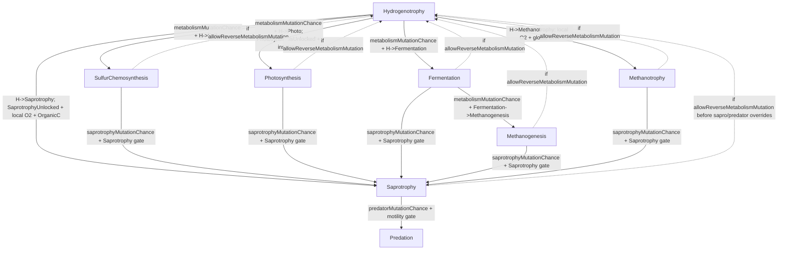
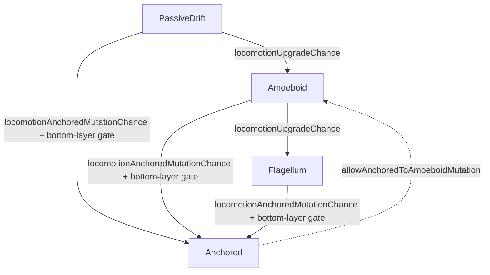
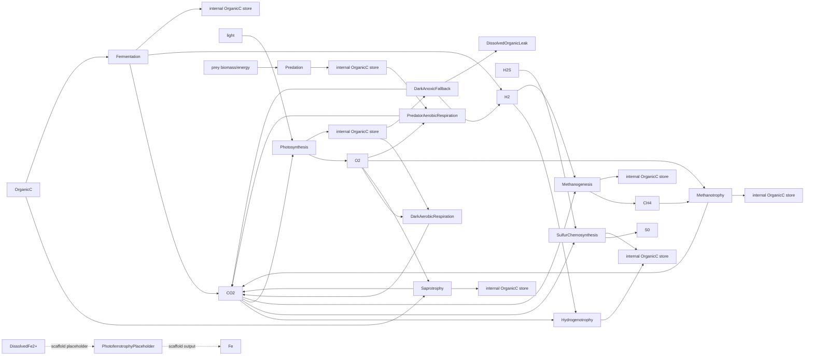
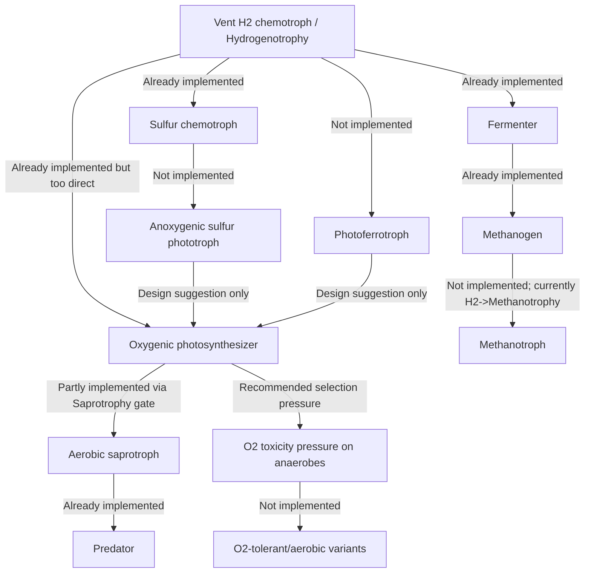

# Current Model Evolution Web Audit

## 1. Executive summary

The current model has an implemented mutation web, but it is narrow and strongly centered on **Hydrogenotrophy** as the default/spawned ancestor. Initial and spontaneous spawns create Hydrogenotrophy + PassiveDrift organisms, usually biased toward H2-rich bottom ocean habitat. Metabolism can mutate on reproduction into SulfurChemosynthesis, Photosynthesis, Fermentation, Methanotrophy, Saprotrophy, Methanogenesis, and Predation through specific gates. This is more than a static enum list, but it is not a fully closed or explicitly environment-driven phylogeny.

Implemented evolvable dimensions include metabolism, locomotion type, temperature optimal band drift, biomass target drift, stored organic carbon/energy state inheritance, and concrete ocean-layer placement inheritance. Missing or ambiguous dimensions include explicit morphology beyond locomotion, metabolism-specific O2 tolerance evolution, layer preference mutation independent of spawn placement, lifespan evolution, nutrient limitation, and multiple plausible early-life pathways such as photoferrotrophy or anoxygenic sulfur photosynthesis.

The current web is **partly coherent for gameplay**: vent/bottom Hydrogenotrophy seeds can lead to photosynthesis, oxygen/OrganicC-gated saprotrophy, methane cycling, and predators. However, the sequence is biologically compressed. Photosynthesis is directly reachable from Hydrogenotrophy as oxygenic photosynthesis, while anoxygenic photosynthesis and iron/sulfur phototrophy are only reaction-scaffold placeholders. O2 toxicity is currently tracked only for Methanotrophy, so there is no broad oxygen-crisis pressure on anaerobes.

## 2. Source files inspected

| File path | Relevant classes/enums/methods | Evidence found |
|---|---|---|
| `Assets/Scripts/ReplicatorData.cs` | `MetabolismType`, `LocomotionType`, `DeathCause`, `Replicator`, `Replicator.Traits`, `GetDefaultPreferredOceanLayerIndex` | Authoritative organism enum values, stored traits/timers, layer fields, default layer preference. |
| `Assets/Scripts/ReplicatorManager.cs` | Inspector settings; `SpawnInitialPopulation`, `SpawnAgentFromPopulation`, `SpawnAgentAtRandomLocation`, `SpawnAgentAtDirection`, `ResolveSpawnLayers`, `AssignTemperatureTraits`, `CanMutateToSaprotrophy`, `CanMutateToMethanotrophy`, `CanMutateToPredation`, `ResolveInheritedLocomotion`, `ResolveEnergyDeathCauseAtIndex` | Reproduction mutation rules, spawn defaults, inheritance behavior, temperature-band mutation, layer placement, starvation attribution. |
| `Assets/Scripts/ReplicatorMetabolismSystem.cs` | `MetabolismTick`, `Process*ReactionBacked`, `TryPhotosynthesisEnergyGain`, `TryPhotosynthAnoxicDarkFallback`, starvation timer updates | Runtime resource consumption/production, energy/carbon storage, death pressure, O2 toxicity scope, photosynthesis light/layer behavior. |
| `Assets/Scripts/ReactionBackedMetabolismScaffolding.cs` | `ReactionId`, `ReactionDefinitionRegistry`, packages for every `MetabolismType` | Reaction-backed resource identities; explicitly marked scaffold/non-authoritative; placeholders for photoferrotrophy/anoxygenic photosynthesis. |
| `Assets/Scripts/ReplicatorPredationSystem.cs` | `RunPredationPass`, `ApplyPredationBite`, layer-binned prey search | Predator feeding is prey-contact backed when scent predation is enabled, with same/adjacent layer search. |
| `Assets/Scripts/ReplicatorDebugTelemetry.cs` | `FormatPopulation`, `FormatDeathCauses`, labels | Debug labels expose intended categories/unlocks and death-cause telemetry. |
| `Assets/Scripts/PlanetGenerator.cs` | biology unlock settings/properties | Photosynthesis and Saprotrophy unlock by elapsed seconds. |
| `Assets/Scripts/PlanetCellInspectorPanel.cs` | cell/layer inspector summary | UI reveals resource/layer chemistry useful for manual audit. |
| `Assets/Scripts/Persistence/SimulationSaveDtos.cs` | population snapshot fields | Confirms persisted organism dimensions including metabolism, locomotion, timers, temperature band, current/preferred layer. |

## 3. Current organism dimensions

| Dimension | Current values | Where defined | Can mutate/evolve? | How inheritance works | Notes |
|---|---|---|---|---|---|
| Metabolism | `SulfurChemosynthesis`, `Hydrogenotrophy`, `Photosynthesis`, `Saprotrophy`, `Predation`, `Fermentation`, `Methanogenesis`, `Methanotrophy` | `MetabolismType` in `ReplicatorData.cs`; mutation in `ReplicatorManager.SpawnAgentFromPopulation` | **Implemented** on reproduction | Child starts as parent metabolism; mutation rules may replace it before spawn | Initial/spontaneous spawn uses Hydrogenotrophy only. |
| Locomotion | `PassiveDrift`, `Amoeboid`, `Flagellum`, `Anchored` | `LocomotionType`; `ResolveInheritedLocomotion` | **Implemented** on reproduction | Child inherits parent locomotion, then may mutate/upgrade | No separate morphology enum found. |
| Temperature range | Optimal min/max plus lethal margin | Replicator fields; manager metabolism ranges; `AssignTemperatureTraits` | **Implemented** as small edge drift | Parentless gets base metabolism range; same metabolism inherits parent range and mutates; metabolism change rebases to new base range | Temperature kills outside optimal range plus lethal margin. |
| Ocean/vertical layer | `currentOceanLayerIndex`, `preferredOceanLayerIndex`; top/bottom/clamped layer | `ReplicatorData`, `ResolveSpawnLayers`, metabolism layer reads | **Partly implemented** | Spawn layer may be dictated by metabolism or inherited from parent current/preferred layer; preferred is then aligned with spawn layer | No independent layer-preference mutation was found. |
| Energy | Float `energy` | `Replicator`; metabolism system; spawn | **State inherited, not trait-evolved** | Parentless random 0.1-0.5; child gets max(0.1, parent energy * 0.5) | Drives death and speed. |
| Organic carbon store | `organicCStore` and `maxOrganicCStore` cap | `Replicator`; metabolism system | **State evolves ecologically, not genetic trait** | New constructor starts 0; metabolism fills/uses store | Store participates in carbon-limited division and starvation. |
| Biomass target | `biomassTarget` | `ReplicatorManager.defaultBiomassTarget`, `biomassMutationChance`, `biomassMutationScale` | **Implemented** as scalar drift | Parentless baseline; child inherits parent target and may multiply by random factor | Used by carbon-limited division. |
| Lifespan/age | `age`, `maxLifespan`; manager min/max lifespan | `Replicator`, `ReplicatorLifecycleSystem`, spawn | **No mutation found** | Every spawned child receives random lifespan between manager min/max; child age starts 0 | Old-age death exists. |
| Reproduction eligibility | `canReplicate`, energy/carbon division settings | Metabolism system and manager lifecycle/division settings | **Runtime state, not inherited trait** | Reset true each metabolism tick; photosynth dark anoxic fallback may disable division | Carbon-limited division can gate reproduction. |
| Sea-only traits | `spawnOnlyInSea`, `replicateOnlyInSea`, `moveOnlyInSea`, `surfaceMoveSpeedMultiplier` | `Replicator.Traits`, `CreateDefaultTraits`/spawn calls | **No mutation found** | Child receives parent traits; default traits assigned to spawns | Trait values are selectable/configured, not evolving in inspected code. |
| O2 tolerance | `o2ComfortMax`, `o2StressMax` | Replicator fields; Methanotrophy metabolism uses them | **No mutation found** | Constructor defaults both to 1; snapshots persist | O2 toxicity timer currently only meaningful in Methanotrophy path. |
| Starvation timers | CO2, H2S, H2, light, OrganicC food, O2, CH4, stored C, O2 toxicity | `Replicator` fields; metabolism system; death attribution | **Runtime state, not genetic** | New agents reset; save/load persists | Timers shape selection by attributing energy-depletion death causes. |

## 4. Current metabolism list

> Note: Runtime behavior is in `ReplicatorMetabolismSystem`. `ReactionBackedMetabolismScaffolding` supplies resource identities and documents scaffold stoichiometries as provisional/non-authoritative.

| MetabolismType | Inputs consumed | Outputs produced | Energy source | Carbon source | Requires O2? | Produces O2? | Produces OrganicC / stores carbon? | Main starvation timers / failure modes | Habitat implied by code | Source files / methods |
|---|---|---|---|---|---|---|---|---|---|---|
| SulfurChemosynthesis | CO2 + H2S | S0; internal OrganicC store from fixed CO2 | H2S chemistry | CO2 | No for main reaction; O2 can be needed only for fallback store respiration attribution | No | Yes, via `chemosynthStoreFraction` | Lack CO2, lack H2S, lack O2/stored C fallback, temp death, energy | Bottom/vent inferred: default preferred layer 4; spawn layer bottom for sulfur | `ProcessSulfurChemosynthesisReactionBacked`, scaffolding package |
| Hydrogenotrophy | CO2 + H2 | Internal OrganicC store; no explicit CH4 in this path | H2 chemistry | CO2 | No | No | Yes, via `hydrogenotrophyStoreFraction` | Lack CO2, lack H2, temp death, energy | Bottom/vent starter: initial/spontaneous spawn Hydrogenotrophy at bottom layer | `SpawnAgentAtRandomLocation`, `ResolveHydrogenotrophySpawnLayer`, `ProcessHydrogenotrophyReactionBacked` |
| Photosynthesis | CO2 + light in light mode; stored OrganicC + O2 in dark aerobic; stored OrganicC without O2 in weak anoxic fallback | O2 in light mode; CO2/H2/dissolved organic leak in anoxic fallback | Light; stored-carbon respiration at night | CO2 / stored photosynthate | Not for daytime photosynthesis; yes for aerobic dark respiration unless anoxic fallback is available | Yes | Yes, stores fixed CO2 as OrganicC | Lack CO2, light, O2, stored C; temp death; dark-anoxic fallback can disable replication | Surface/top layer: photosynthesis spawn layer top and layer light attenuation | `ProcessPhotosynthesisMetabolism`, `TryPhotosynthesisEnergyGain`, `TryPhotosynthAnoxicDarkFallback` |
| Saprotrophy | OrganicC + O2 for respired fraction; can store part of OrganicC | CO2 | Aerobic respiration of OrganicC | Environmental OrganicC / internal store | Yes for energy-respired portion | No | Yes, assimilates environmental OrganicC | Lack OrganicC food, O2, stored C, temp death | O2 + OrganicC habitat; mutation gated by local O2 and OrganicC | `CanMutateToSaprotrophy`, `ProcessSaprotrophyReactionBacked` |
| Fermentation | OrganicC | CO2 + H2 by runtime binding outputs | OrganicC fermentation | OrganicC | No | No | Yes, assimilation fraction stores OrganicC | Lack OrganicC food, stored capacity flag, temp death, energy | OrganicC-rich anoxic habitat inferred | `ProcessFermentationReactionBacked` |
| Methanogenesis | CO2 + H2 | CH4; some CO2 assimilated to store | H2/CO2 methanogenesis | CO2 | No | No | Yes, assimilation fraction | Lack CO2, H2, stored capacity flag, temp death | Bottom/reduced habitat; spawn layer bottom | `ProcessMethanogenesisReactionBacked`, `ResolveSpawnLayers` |
| Methanotrophy | CH4 + O2 | CO2; some CH4 assimilated to store | CH4 oxidation | CH4 | Yes | No | Yes, assimilation fraction | Lack CH4, O2, stored capacity flag, O2 toxicity, temp death | O2 + methane interface inferred; mutation requires local O2 and global CH4 | `CanMutateToMethanotrophy`, `ProcessMethanotrophyReactionBacked` |
| Predation | Prey OrganicC/energy via predation pass; stored OrganicC + O2 in metabolism tick | CO2 from store respiration; leaked/death OrganicC to environment | Prey bites and aerobic store respiration | Prey biomass / OrganicC store | Yes for metabolism-store respiration | No | Yes, prey bite assimilation to store | Lack food, O2, stored C; predation deaths for prey; temp death | Motile saprotroph descendant; same/adjacent layer prey bins | `CanMutateToPredation`, `ReplicatorPredationSystem.RunPredationPass`, predator branch in metabolism tick |

## 5. Actual evolution / mutation transitions

### 5.1 Metabolism transitions

| From state | Can evolve/mutate to | Probability / rule | Gate / condition | Source |
|---|---|---|---|---|
| Parent metabolism | Same metabolism | Default | No mutation chosen | `SpawnAgentFromPopulation` |
| Hydrogenotrophy | Photosynthesis | Outer `metabolismMutationChance`, then `hydrogenToPhotosynthesisMutationChance` | `planetGenerator.PhotosynthesisUnlocked` and parent location has insolation | `SpawnAgentFromPopulation`, `IsInsolatedLocation` |
| Hydrogenotrophy | SulfurChemosynthesis | Outer `metabolismMutationChance`, then `hydrogenToSulfurMutationChance` | No resource gate in mutation code | `SpawnAgentFromPopulation` |
| Hydrogenotrophy | Fermentation | Outer `metabolismMutationChance`, then `hydrogenToFermentationMutationChance` | No resource gate in mutation code | `SpawnAgentFromPopulation` |
| Fermentation | Methanogenesis | Outer `metabolismMutationChance`, then `fermentationToMethanogenesisMutationChance` | No resource gate in mutation code | `SpawnAgentFromPopulation` |
| Any non-Hydrogenotrophy branch inside outer mutation block | Hydrogenotrophy | Outer `metabolismMutationChance`; if `allowReverseMetabolismMutation` | `allowReverseMetabolismMutation` true | `SpawnAgentFromPopulation` |
| Hydrogenotrophy | Methanotrophy | Independent `hydrogenToMethanotrophyMutationChance` | Local O2 available and global CH4 > 0.01 | `CanMutateToMethanotrophy` |
| Hydrogenotrophy or most non-saprophyte metabolisms | Saprotrophy | Independent chance: Hydrogenotrophy uses `hydrogenToSaprotrophyMutationChance`, others use `saprotrophyMutationChance` | `SaprotrophyUnlocked`; local O2 and local OrganicC | `CanMutateToSaprotrophy` |
| Saprotrophy | Predation | `predatorMutationChance` | Predators enabled; Saprotrophy unlocked; parent is Saprotrophy; predator requires motility unless disabled | `CanMutateToPredation` |

### 5.2 Locomotion transitions

| From state | Can evolve/mutate to | Probability / rule | Gate / condition | Source |
|---|---|---|---|---|
| Any locomotion | Same locomotion | Default | `locomotionMutationChance` not hit, or no selected transition succeeds | `ResolveInheritedLocomotion` |
| PassiveDrift | Amoeboid | `locomotionMutationChance` then `locomotionUpgradeChance` | Not an anchored mutation branch | `ResolveInheritedLocomotion` |
| Amoeboid | Flagellum | `locomotionMutationChance` then `locomotionUpgradeChance` | Not an anchored mutation branch | `ResolveInheritedLocomotion` |
| PassiveDrift/Amoeboid/Flagellum | Anchored | `locomotionMutationChance` then `locomotionAnchoredMutationChance` | `CanMutateToAnchored`; in ocean requires current layer equals bottom layer | `CanMutateToAnchored` |
| Anchored | Amoeboid | `locomotionMutationChance`, anchored branch, `allowAnchoredToAmoeboidMutation`, then `anchoredToAmoeboidMutationChance` | Reverse anchoring enabled | `ResolveInheritedLocomotion` |

### 5.3 Temperature-band changes

| From state | Can evolve/mutate to | Probability / rule | Gate / condition | Source |
|---|---|---|---|---|
| Parentless spawn | Base metabolism range | Deterministic | Based on child metabolism | `AssignTemperatureTraits`, manager temp ranges |
| Same-metabolism child | Parent optimal min/max with edge drift | Each edge independently mutates with `tempMutationChance` by ±`tempMutationScale` K | Same metabolism | `AssignTemperatureTraits` |
| Metabolism-changed child | New metabolism base range with edge drift | Rebase first, then edge drift | Parent metabolism != child metabolism | `AssignTemperatureTraits` |

### 5.4 Layer-preference / vertical placement changes

| From state | Can evolve/mutate to | Probability / rule | Gate / condition | Source |
|---|---|---|---|---|
| Parentless Hydrogenotrophy | Bottom layer | Deterministic | Ocean cell with valid bottom layer | `ResolveSpawnLayers` |
| Photosynthesis child | Top layer | Deterministic | Ocean cell with valid top layer | `ResolveSpawnLayers` |
| Hydrogenotrophy/SulfurChemosynthesis/Methanogenesis child | Bottom layer | Deterministic | Ocean cell with valid bottom layer | `ResolveSpawnLayers` |
| Other child with parent | Parent current layer, else parent preferred, else agent default preferred | Deterministic clamp to spawn cell | Valid ocean layer if possible | `ResolveSpawnLayers` |
| Preferred layer after spawn | Current spawn layer | Deterministic | Any valid spawn layer | `ResolveSpawnLayers` |

No code-backed random mutation of preferred layer itself was found.

### 5.5 Trait/parameter drift

| Trait/parameter | Can evolve/mutate to | Probability / rule | Gate / condition | Source |
|---|---|---|---|---|
| Biomass target | Multiplicative drift | `biomassMutationChance`; factor `1 ± biomassMutationScale`, clamped | Parent exists | `SpawnAgentAtDirection` |
| Locomotion skill | Same value | No mutation found | Parent exists | `ResolveInheritedLocomotionSkill` |
| Lifespan | Random manager range | No inheritance/mutation found | Every spawn | `SpawnAgentAtDirection` |
| Sea-only traits | Same traits | No mutation found | Child receives `parent.traits` | `SpawnAgentFromPopulation` / `SpawnAgentAtDirection` |
| O2 tolerance | Same default/snapshot value | No mutation found | Constructor defaults comfort/stress max to 1 | `Replicator` constructor |

## 6. Mermaid graph of the current evolution web

Locomotion web:

## 7. Ecological dependency web

## 8. Does the current sequence make sense?

### 8.1 Biological plausibility

* **Anaerobic chemotrophs before oxygen: implemented/partly plausible.** The default seeded organism is Hydrogenotrophy, bottom-layer biased, and it consumes CO2 + H2 without O2. SulfurChemosynthesis and Methanogenesis are also anaerobic-style metabolisms.
* **Anoxygenic photosynthesis: not implemented as a real metabolism.** Photoferrotrophy, sulfur anoxygenic photosynthesis, and hydrogen anoxygenic photosynthesis exist only as zero-energy or placeholder reactions inside the photosynthesis scaffold package. They are not separate `MetabolismType` values and no mutation transitions target them.
* **Oxygenic photosynthesis: implemented.** Photosynthesis consumes CO2 with light and produces O2; it is reachable from Hydrogenotrophy after a time unlock and only from an insolated parent location.
* **Oxygen crisis / O2 toxicity: mostly missing.** `DeathCause.O2_Toxicity` exists and Methanotrophy sets an O2 toxicity timer if O2 exceeds tolerance, but non-methanotroph metabolisms reset O2 toxicity to zero. There is no broad O2 toxicity pressure on Hydrogenotrophy, Fermentation, Methanogenesis, or SulfurChemosynthesis.
* **Aerobic saprotrophy: implemented.** Saprotrophy consumes OrganicC and O2, produces CO2, stores a fraction of carbon, and is gated by local O2 + OrganicC.
* **Methane cycle: partly implemented.** Methanogenesis produces CH4 from CO2 + H2; Methanotrophy consumes CH4 + O2 and produces CO2. Mutation to Methanotrophy is from Hydrogenotrophy, not from Methanogenesis.
* **Predator-like behavior: implemented as simplified predation.** Predators can bite prey in spatial/layer bins, gain/store carbon and energy, and kill prey below an energy threshold. Predator metabolism also needs stored C/O2 for ongoing respiration.

### 8.2 Gameplay progression

The current code can create interesting stages:

1. **Vent/bottom starter ecology:** Hydrogenotrophy spawns at bottom ocean layers and spawn candidates are biased by H2/CO2/temperature.
2. **Branching anaerobic expansion:** Hydrogenotrophs can branch to SulfurChemosynthesis or Fermentation, and Fermentation can lead to Methanogenesis.
3. **Surface photic expansion:** Hydrogenotrophy can mutate to Photosynthesis only after the unlock and at an insolated location; photosynths spawn into the top layer.
4. **Oxygenation and OrganicC gate:** Photosynthesis can generate O2 and stored carbon; Saprotrophy requires local O2 and OrganicC.
5. **Methane cycling:** Methanogenesis and Methanotrophy can form a resource loop if both CH4 and O2 are present.
6. **Predator/saprophyte food web:** Saprotrophs can mutate to predators if motile; predation adds direct prey pressure and death OrganicC feedback.

Main gameplay weakness: several transitions are probability-only once broad gates pass. There is little explicit resource-gated selection for SulfurChemosynthesis, Fermentation, or Methanogenesis mutation, and no layer-preference mutation that would make depth adaptation feel like speciation.

### 8.3 Code reality check

| Issue | Code-backed finding | Impact |
|---|---|---|
| Metabolism mutation exists but is centralized around Hydrogenotrophy | Initial spawns are Hydrogenotrophy, most direct named transitions originate from Hydrogenotrophy; Methanogenesis comes only from Fermentation; Predation comes only from Saprotrophy | The web is a hub-and-branches design rather than a richly connected evolutionary network. |
| Anoxygenic photosynthesis and photoferrotrophy are placeholders | Scaffolding includes placeholder reactions under Photosynthesis package, but no enum/metabolism/mutation route | Early-life phototrophy sequence skips directly to oxygenic photosynthesis. |
| O2 toxicity only shapes Methanotrophy | Non-methanotrophy paths reset `O2ToxicSeconds`; Methanotrophy alone sets `o2Toxic` | No oxygen catastrophe for anaerobic lineages. |
| Starvation timers are reset by metabolism branch | Each branch clears irrelevant timers; energy-depletion death cause uses the largest timer past threshold | Death attribution is useful, but timers do not accumulate cross-metabolism deprivation history. |
| Predation does depend on prey capture, but predator starvation is store/O2 based | Predation pass handles prey bites; metabolism tick treats predator food as lacking unless store respiration succeeds | Predator survival depends on successful bites indirectly through store/energy, not on an explicit “recent prey captured” timer. |
| Layer preference exists but is mostly spawn placement | Preferred layer is aligned to current spawn layer; no independent mutation found | Layering affects resources, light, predation bins, and spawn location, but not a heritable depth strategy beyond current placement. |
| Temperature adaptation exists but may be gradual rather than speciation-like | Same-metabolism children inherit and slightly drift temp band; metabolism-changed children rebase to metabolism defaults | Temperature can select/kill, but there is no named ecotype/species split. |
| Reaction-backed definitions are not fully authoritative | Scaffolding comments say provisional/non-authoritative; runtime methods still contain branch-specific logic | Audit/balance should rely on metabolism system behavior first. |

## 9. Missing links / recommended additions

| Priority | Missing link | Why it matters | Minimal code change | Larger design version |
|---|---|---|---|---|
| 1 | Explicit metabolism mutation gates by local resource/habitat for SulfurChemosynthesis, Fermentation, Methanogenesis | Prevents improbable branches and makes environment drive evolution | Add `CanMutateToSulfur`, `CanMutateToFermentation`, `CanMutateToMethanogenesis` using local H2S/OrganicC/H2/CO2 | Trait-based adaptive mutation weights from habitat scores and recent starvation causes |
| 2 | O2 toxicity for anaerobes | Enables oxygen crisis and post-photosynthesis selection pressure | Apply O2 toxicity timer to Hydrogenotrophy, Fermentation, Methanogenesis, maybe SulfurChemosynthesis above configurable thresholds | Evolve O2 tolerance/detox trait with cost and staged aerobic transition |
| 3 | Anoxygenic sulfur photosynthesis | Bridges vent chemistry to photic ecology before oxygen | Add enum/metabolism or subtype consuming CO2 + H2S + light, producing OrganicC + S0, no O2 | Split phototroph clade into sulfur, hydrogen, iron, then oxygenic photosynthesis |
| 4 | Photoferrotrophy / iron oxidation | Current resource map includes DissolvedFe2+ and scaffold placeholder; useful early photic path | Promote placeholder to metabolism or trait; consume CO2 + Fe2+ + light | Add Fe redox cycle with sediment/particle feedback and oxygen sink |
| 5 | Explicit predator-prey biomass transfer tuning | Predation exists, but progression depends on store/energy side effects | Add predator “recent prey intake” telemetry/starvation timer | Food-web model with prey size, capture probability, predator specialization |
| 6 | Layer-preference mutation | Makes vertical ocean architecture evolutionary, not just positional | Add small chance to mutate preferred layer ±1, clamped by cell, with metabolism-specific bias | Evolve depth niche, pressure/light tolerance, vertical migration behavior |
| 7 | Nutrient limitation (N/P) | OrganicC/O2 alone can create runaway biomass and incomplete ecology | Add generic nutrient gate to replication | Full nutrient cycles: N fixation, phosphate limitation, remineralization |
| 8 | Iron/sulfur reduction or sulfate reduction | Completes anaerobic recycling of oxidized products | Add S0/sulfate reduction consuming OrganicC/H2 and producing H2S | Multi-redox ladder ecology with oxygen gradients |
| 9 | Environment-driven mutation weights | Current mutation mostly random after gates | Bias mutations by parent starvation timers and local resource gradients | Adaptive radiation system with inheritable traits and fitness-based mutation rates |
| 10 | Venus/cloud-layer adaptation path | Relevant only if current architecture is reused for cloud/ocean layers | Reuse layer-preference and resource APIs with alternate layer labels | Separate planetary biome model with aerosols, acidity, UV shielding, cloud decks |

## 10. Suggested revised evolution web

Status labels below are for the **current water/ocean planet model**:

| Proposed transition | Status | Notes |
|---|---|---|
| Vent H2 chemotroph → Fermenter | **Already implemented** | Hydrogenotrophy can mutate to Fermentation, but without an OrganicC gate. |
| Vent H2 chemotroph → Sulfur chemotroph | **Already implemented** | Hydrogenotrophy can mutate to SulfurChemosynthesis, but without H2S gate. |
| Fermenter → Methanogen | **Already implemented** | Fermentation can mutate to Methanogenesis. |
| Vent/Sulfur chemotroph → Anoxygenic sulfur phototroph | **Not implemented** | Placeholder exists only inside reaction scaffolding. |
| Vent chemotroph → Photoferrotroph | **Not implemented** | Placeholder exists only inside reaction scaffolding. |
| Anoxygenic phototroph / photoferrotroph → Oxygenic photosynthesizer | **Design suggestion only** | Current code jumps Hydrogenotrophy → Photosynthesis. |
| Oxygenic photosynthesizer → Aerobic saprotroph | **Partly implemented** | Saprotrophy can arise from many types including Photosynthesis if O2 + OrganicC gate passes, but not as a named phototroph-specific path. |
| Methanogen → Methanotroph | **Not implemented** | Methanotrophy currently mutates from Hydrogenotrophy under O2 + CH4 gate. |
| Aerobic saprotroph → Predator | **Already implemented** | Requires Saprotrophy parent and usually motility. |
| Anaerobes → O2-tolerant/aerobic variants | **Not implemented** | No broad O2 tolerance mutation found. |

## 11. Concrete next-step recommendation

* **Inspect manually in the Inspector/UI:** watch `ReplicatorManager` mutation chances/unlock seconds, local O2/OrganicC thresholds, layer settings, and the cell inspector layer resources (O2, CO2, DissolvedFe2+, CH4, H2, H2S, light, OrganicC, temperature) while running a fixed seed.
* **Debug counters that would help:** per-transition mutation counters, denied-mutation counters by gate reason, per-metabolism layer histogram, parent→child layer transition histogram, per-metabolism O2 exposure histogram, and starvation-timer histograms before death.
* **Single code addition that would most improve the evolution web:** add resource-gated mutation helpers for SulfurChemosynthesis, Fermentation, and Methanogenesis, then log success/failure counters. This would make early branches environment-backed without a large refactor.
* **Single design decision before adding more metabolisms:** decide whether `MetabolismType` should remain coarse public identity with sub-reaction packages/traits beneath it, or whether each major pathway (anoxygenic sulfur phototrophy, photoferrotrophy, oxygenic photosynthesis, sulfate reduction, iron reduction) should become its own explicit `MetabolismType` and mutation node.
